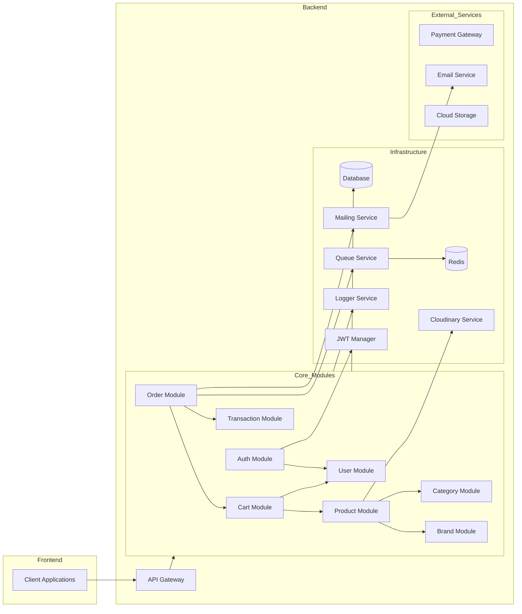

# Watch E-Commerce Store Back-end API service

---

## Backend System Architecture

```mermaid
graph LR
    subgraph Frontend
        Client[Client Applications]
    end

    subgraph Backend
        API[API Gateway]
        
        subgraph Core_Modules
            Auth[Auth Module]
            User[User Module]
            Product[Product Module]
            Category[Category Module]
            Brand[Brand Module]
            Cart[Cart Module]
            Order[Order Module]
            Transaction[Transaction Module]
        end

        subgraph Infrastructure
            DB[(Database)]
            Redis[(Redis)]
            Cloudinary[Cloudinary Service]
            Queue[Queue Service]
            Mail[Mailing Service]
            Logger[Logger Service]
            JWT[JWT Manager]
        end

        subgraph External_Services
            Payment[Payment Gateway]
            Email[Email Service]
            Storage[Cloud Storage]
        end
    end

    Client --> API
    API --> Core_Modules
    
    Auth --> JWT
    Auth --> User
    
    Product --> Category
    Product --> Brand
    Product --> Cloudinary
    
    Cart --> Product
    Cart --> User
    
    Order --> Cart
    Order --> Transaction
    Order --> Queue
    Order --> Mail
    
    Queue --> Redis
    Mail --> Email
    
    Core_Modules --> DB
    Core_Modules --> Logger
```
