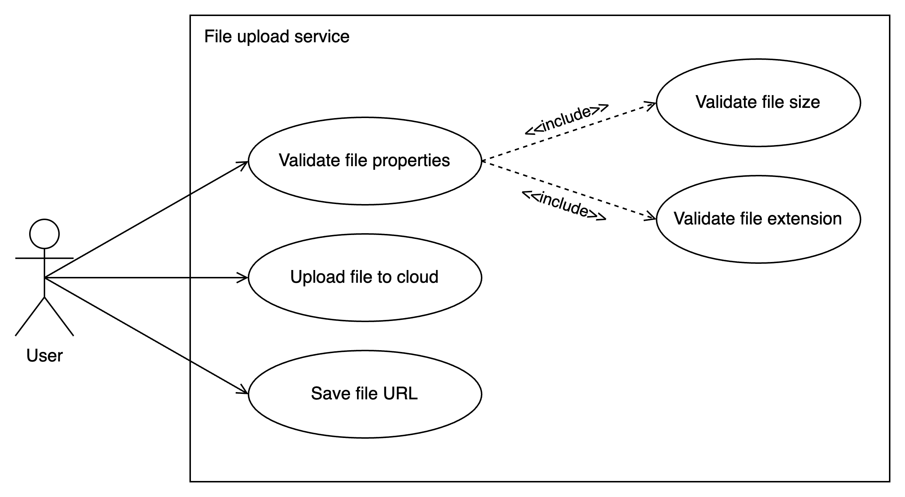
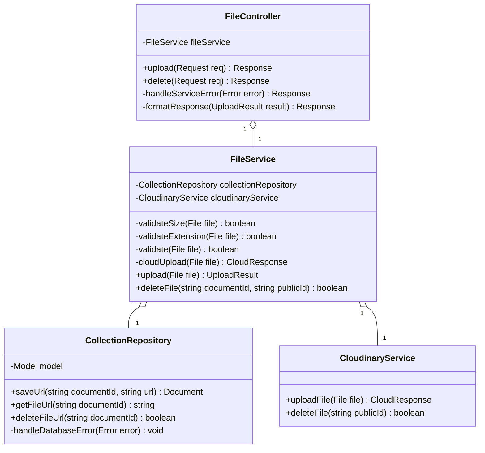
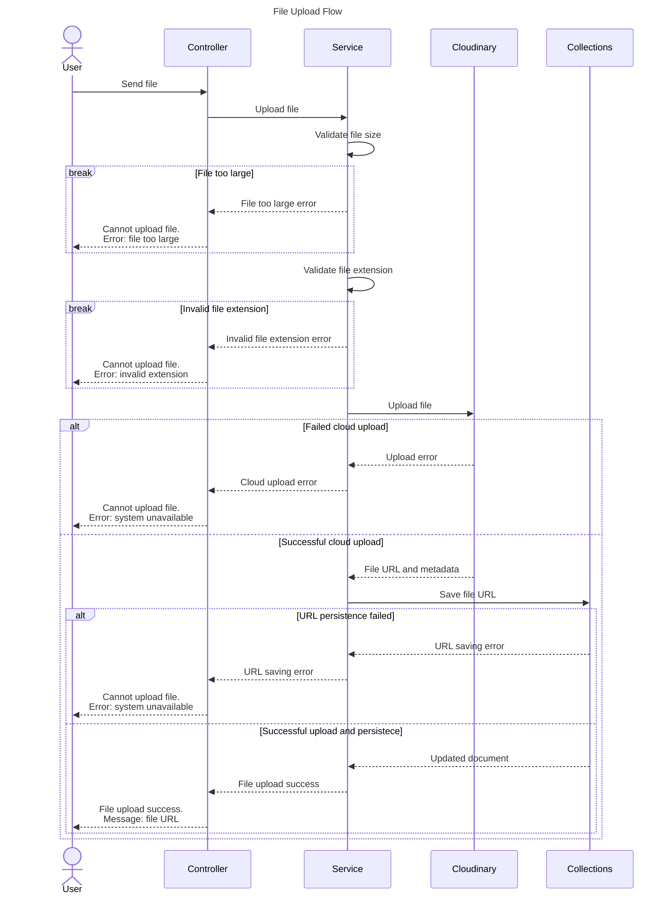
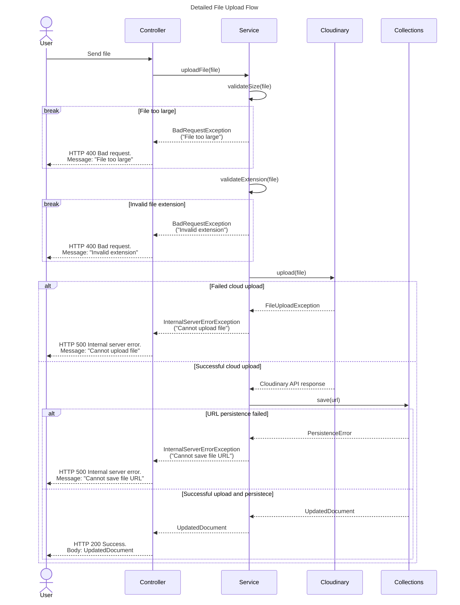
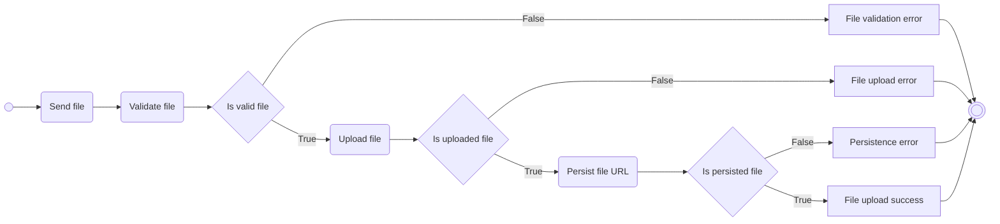

# Cloud file upload use case

> This is a file upload use case to the Cloudinary service

---

## Use case diagram

## Component class diagram

## Sequence diagram

## Detailed sequence diagram of file upload API

This is a more detailed sequence diagram of the file upload API of the system with data provided.

## Activity diagram

