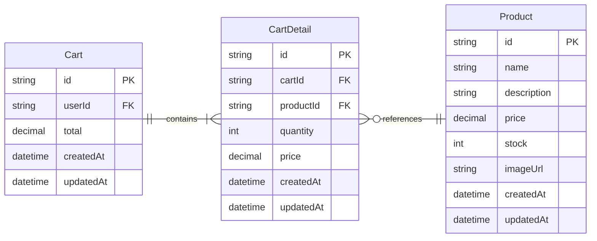
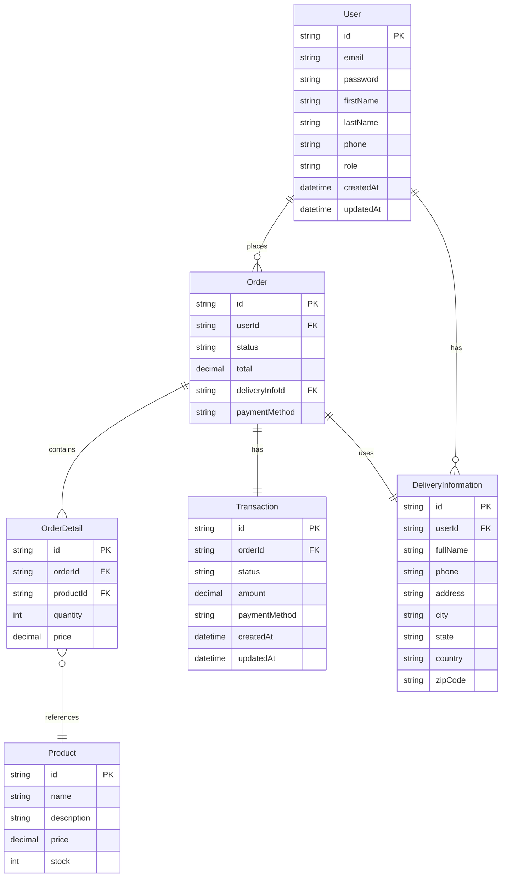
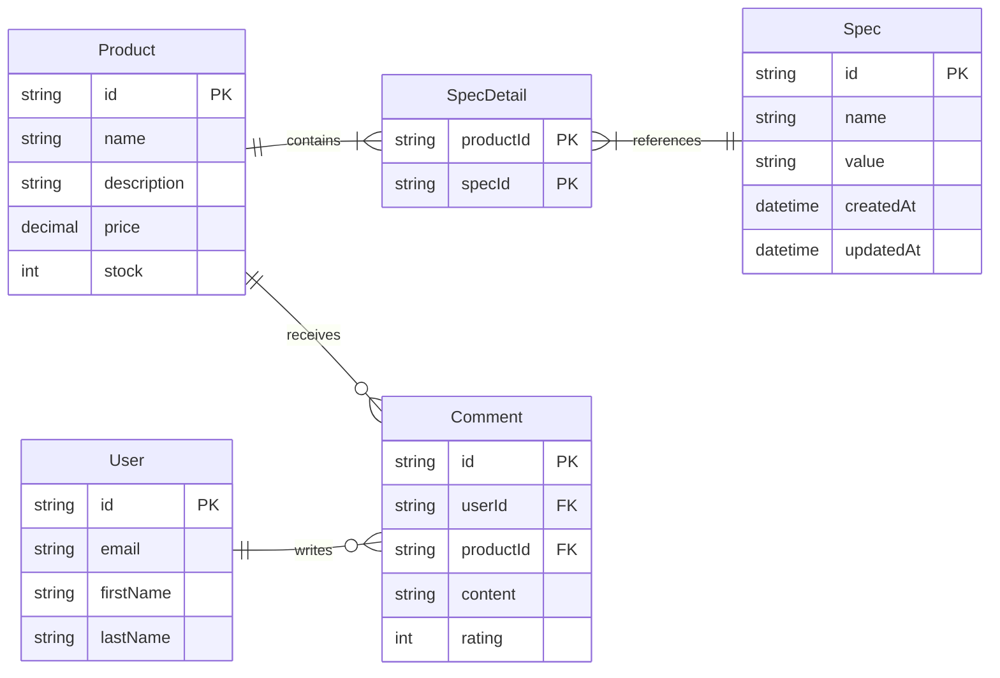
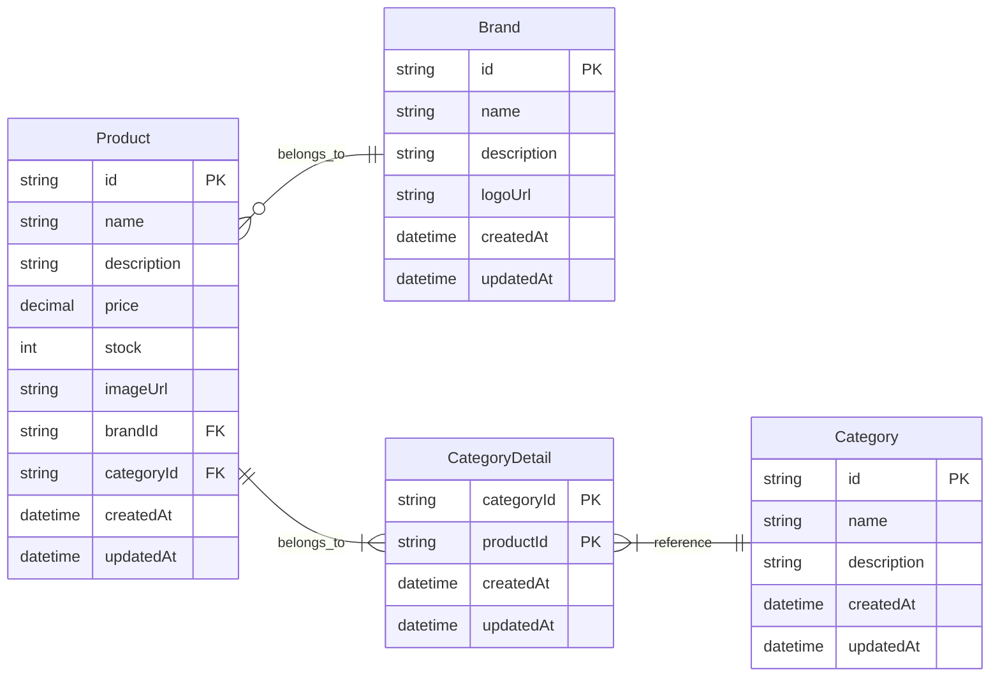

## Product and cart ERD

```mermaid
erDiagram
    direction LR
    Product {
        string id PK
        string name
        string description
        decimal price
        int stock
        string imageUrl
        datetime createdAt
        datetime updatedAt
    }

    Cart {
        string id PK
        string userId FK
        decimal total
        datetime createdAt
        datetime updatedAt
    }

    CartDetail {
        string id PK
        string cartId FK
        string productId FK
        int quantity
        decimal price
        datetime createdAt
        datetime updatedAt
    }

    Cart ||--|{ CartDetail : contains
    CartDetail }o--|| Product : references
```

## Product, order and user ERD

```mermaid
erDiagram
    %% direction TD
    User {
        string id PK
        string email
        string password
        string firstName
        string lastName
        string phone
        string role
        datetime createdAt
        datetime updatedAt
    }

    Product {
        string id PK
        string name
        string description
        decimal price
        int stock
    }

    Order {
        string id PK
        string userId FK
        string status
        decimal total
        string deliveryInfoId FK
        string paymentMethod
    }

    OrderDetail {
        string id PK
        string orderId FK
        string productId FK
        int quantity
        decimal price
    }

    Transaction {
        string id PK
        string orderId FK
        string status
        decimal amount
        string paymentMethod
        datetime createdAt
        datetime updatedAt
    }

    DeliveryInformation {
        string id PK
        string userId FK
        string fullName
        string phone
        string address
        string city
        string state
        string country
        string zipCode
    }

    User ||--o{ Order : places
    User ||--o{ DeliveryInformation : has
    Order ||--|{ OrderDetail : contains
    OrderDetail }o--|| Product : references
    Order ||--|| DeliveryInformation : uses
    Order ||--|| Transaction : has

```

## Product, Product specification, Comment, and User ERD

```mermaid
erDiagram
    direction LR
    Product {
        string id PK
        string name
        string description
        decimal price
        int stock
    }

    Spec {
        string id PK
        string name
        string value
        datetime createdAt
        datetime updatedAt
    }

    SpecDetail {
        string productId PK
        string specId PK
    }

    Comment {
        string id PK
        string userId FK
        string productId FK
        string content
        int rating
    }

    User {
        string id PK
        string email
        string firstName
        string lastName
    }

    User ||--o{ Comment : writes
    Product ||--o{ Comment : receives
    Product ||--|{ SpecDetail: contains
    SpecDetail }|--|| Spec: references
```

## Product, brand and category

```mermaid
erDiagram
    direction LR
    Product {
        string id PK
        string name
        string description
        decimal price
        int stock
        string imageUrl
        string brandId FK
        string categoryId FK
        datetime createdAt
        datetime updatedAt
    }

    Brand {
        string id PK
        string name
        string description
        string logoUrl
        datetime createdAt
        datetime updatedAt
    }

    Category {
        string id PK
        string name
        string description
        datetime createdAt
        datetime updatedAt
    }

    CategoryDetail {
        string categoryId PK
        string productId PK
        datetime createdAt
        datetime updatedAt
    }

    Product }o--|| Brand : belongs_to
    Product ||--|{ CategoryDetail : belongs_to
    CategoryDetail }|--|| Category : reference
```

